# Documentation

Cette documentation a pour but de présenter l'[outil de calcul](https://amoen-calcul.streamlit.app/) de la méthodologie AMOén et de décrire comment l'utiliser.

## Table of Contents

- [Introduction](#introduction)
- [Onglets](#onglets)
  - [0 Readme](#0-readme)
  - [1 Données du site](#1-données-du-site)
    - [Chargement des données de base du projet](#chargement-des-données-de-base-du-projet)
      - [Elements à renseigner](#elements-à-renseigner)
    - [2 Note de calcul](#2-note-de-calcul)
    - [3 Résultats](#3-résultats)
      - [Synthèse des résultats](#synthèse-des-résultats)
      - [Graphiques](#graphiques)
    - [4 Historique](#4-historique)
      - [Plan](#plan)
      - [Historique IDC](#historique-idc)
      - [Historique résultats méthodologie AMOén](#historique-résultats-méthodologie-amoén)
    - [5 Générer rapport](#5-générer-rapport)
- [FAQ](#faq)
  - [Site zzz](#site-zzz)
  - [Comment changer le mot de passe?](#comment-changer-le-mot-de-passe)
  - [Changer le mode sombre/clair](#changer-le-mode-sombreclair)

## TLDR

TLDR (Too Long Didn't Read) est une section qui résume les points clés de l'utilisation de l'outil.

1) Se connecter à l'[outil de calcul](https://amoen-calcul.streamlit.app/) avec un nom d'utilisateur et un mot de passe.
2) Onglet *"1 Données du site"* :
    - Sélectionner un projet.
    - Renseigner les dates de début et fin de la période de calcul.
    - Renseigner les affectations.
    - Renseigner les agents énergétiques utilisés et les quantités.
    - **Cliquer sur le bouton *Sauvegarder*.**
3) Onglet *"3 Résultats"* : Vérifier les résultats du calcul de l'atteinte de l'objectif.
4) Onglet *"5 Générer rapport"* : Générer un rapport PDF avec les résultats du calcul.

<https://github.com/user-attachments/assets/9b8e56dc-d415-4c36-9d92-0b03a72ec0a4>

## Introduction

L'écran d'accueil de l'[outil de calcul](https://amoen-calcul.streamlit.app/) permet de se connecter à l'outil. Pour cela, il faut renseigner un nom d'utilisateur et un mot de passe. Vous devriez avoir reçu ces informations par courriel.

Une fois connecté, vous arrivez sur l'écran principal de l'outil.

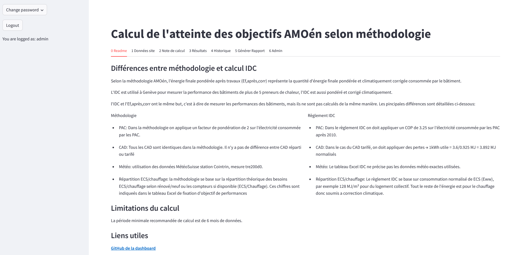

Celui-ci est composé de plusieurs onglets:

- **0 Readme**: Rappel des différences entre la méthodologie AMOén et le calcul IDC. Recommendation de 6 mois de donneés minimium pour le calcul de l'atteinte de l'objectif. Lien vers le Github de l'outil.

- **1 Données du site**: Données concernant le site ou l'on souhaite calculer l'atteinte de l'objectif.

- **2 Note de calcul**: Détail de tous les calculs réalisés.

- **3 Résultats**: Résultats du calcul de l'atteinte de l'objectif.

- **4 Historique**: Historique IDC pour le site sélectionné. Historique des calculs de l'atteinte de l'objectif précédents.

- **5 Générer rapport**: Génération du rapport PDF.

- **6 Admin**: Vue réservée aux administrateurs de l'outil.

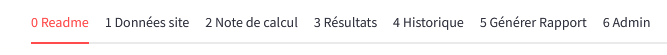

## Onglets

### 0 Readme

Cet onglet contient:

- un rappel des différences entre la méthodlogie AMOén et le calcul IDC
- la recommendation d'avoir au moins 6 mois de données pour le calcul de l'atteinte de l'objectif
- le lien vers le Github de l'outil est également disponible

### 1 Données du site

Cet onglet contient les informations nécessaires au calcul de l'atteinte de l'objectif. 

#### Chargement des données de base du projet

L'image ci-dessous permet d'avoir un aperçu des données à renseigner.

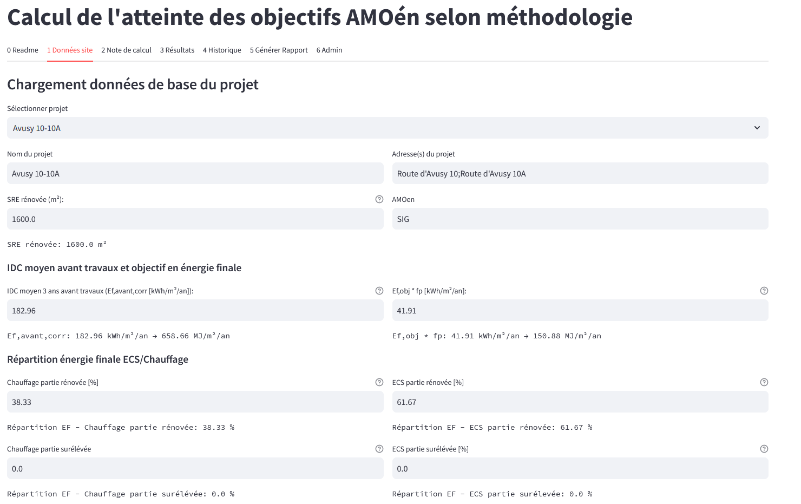

*Sélectionner projet* permet de voir une liste des projets et d'en sélectionner un. Les données de tous les champs sont alors automatiquement renseignées. Par exemple dans l'image ci-dessous, le projet "Avusy 10-10A" a été sélectionné.

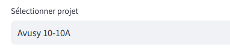

#### Elements à renseigner

**Il est nécessaire de renseigner tous les champs dans cette section pour pouvoir continuer.**

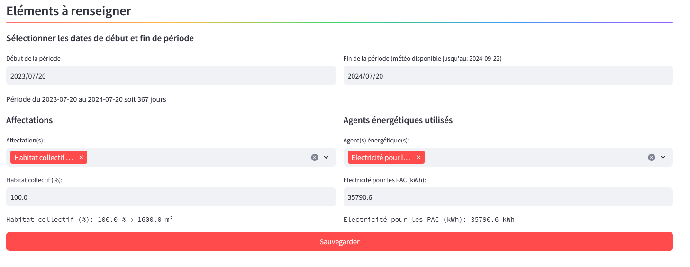

Comme on peut le voir dans l'image ci-dessus, il faut renseigner les données suivantes:

- Dates de début et fin de la période de calcul

- Affectations (souvent rempli automatiquement)

- Agents énergétiques utilisés et quantités

**Le bouton *Sauvegarder* permet de valider les données renseignées. Sans cela les données renseignées sont perdues.**

### 2 Note de calcul

Cet onglet contient le détail de tous les calculs réalisés.

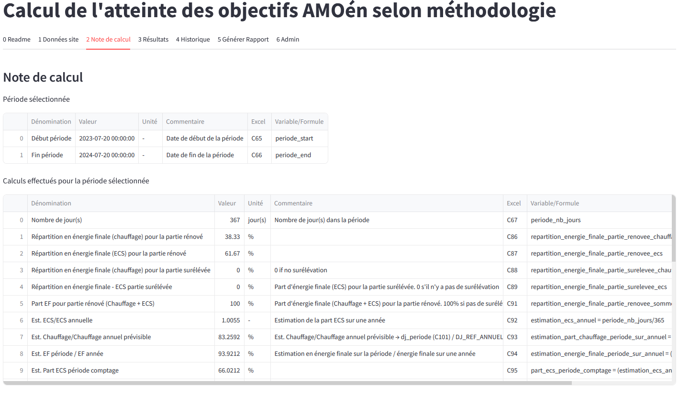

Il contient plusieurs sections:

- Période sélectionnée: Celle-ci indique le début et la fin de la période de calcul.

- Calculs effectués pour la période sélectionnée: Indique les calculs réalisés avec des commentaires. Inclus aussi une référence à la cellule Excel correspondante.

- Agents énergétiques: Liste des agents énergétiques utilisés pour le calcul avec le détail du calcul du facteur de pondération utilisé.

- Données météo station Genève-Cointrin pour la période sélectionnée: données météo utilisées pour le calcul des degrés-jours.

### 3 Résultats

Cet onglet contient les résultats du calcul de l'atteinte de l'objectif.

#### Synthèse des résultats

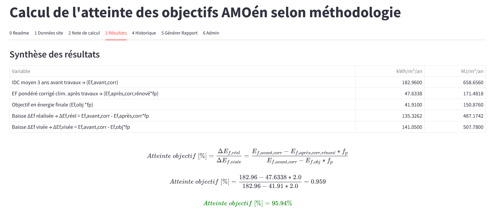

La première section *Synthèse des résultats* indique le pourcentage d'atteinte de l'objectif. Si ce pourcentage est supérieur ou égal à 85%, l'objectif est atteint. Si ce pourcentage est inférieur à 85%, l'objectif n'est pas atteint.

#### Graphiques

La deuxième section *Graphiques* contient le graphique qui résume les résultats du calcul.

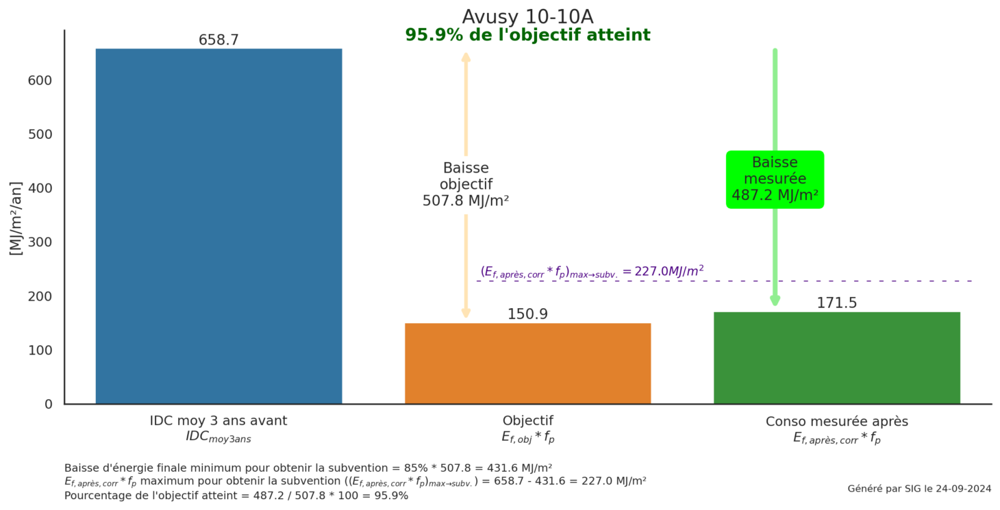

Il est possible de sauvegarder ce graphique en faisant clic sur le bouton droit de la souris et en sélectionnant *Enregistrer l'image sous...*.

### 4 Historique

Cet onglet contient l'historique des résultats obtenus et l'IDC pour le site sélectionné.

#### Plan

Si l'on sélectionne la case *Afficher la carte*, on peut voir le plan de situation du site.

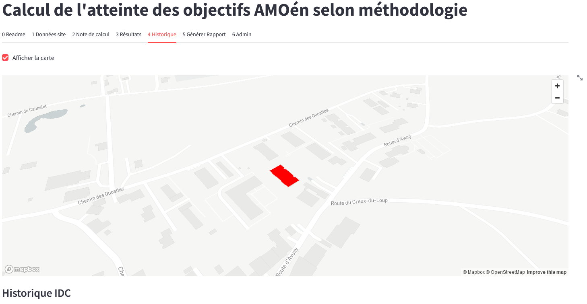

Cette option est désactivée par défaut pour des raisons de performance.

#### Historique IDC

Cette section contient un historique des IDC pour le site sélectionné.

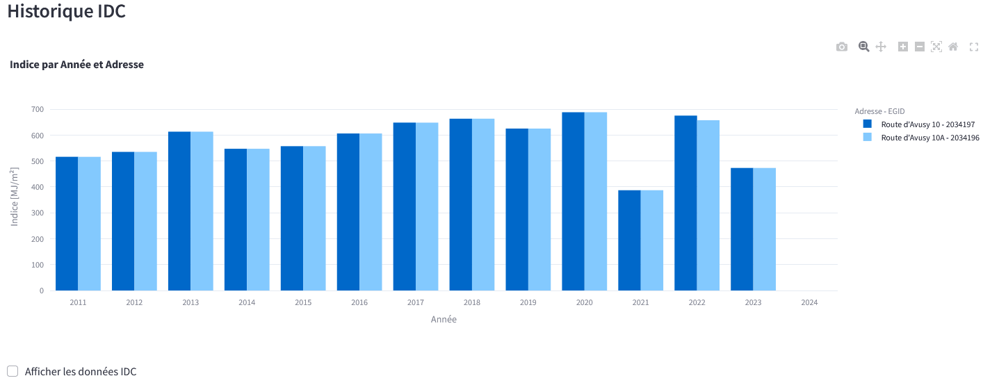

Si l'on coche la case *Afficher les données IDC*, on peut voir les données utilisées pour ce graphique.

#### Historique résultats méthodologie AMOén

Cette section contient un historique de l'atteinte de l'objectif pour le site sélectionné. Les résultats sont classés par date de calcul.

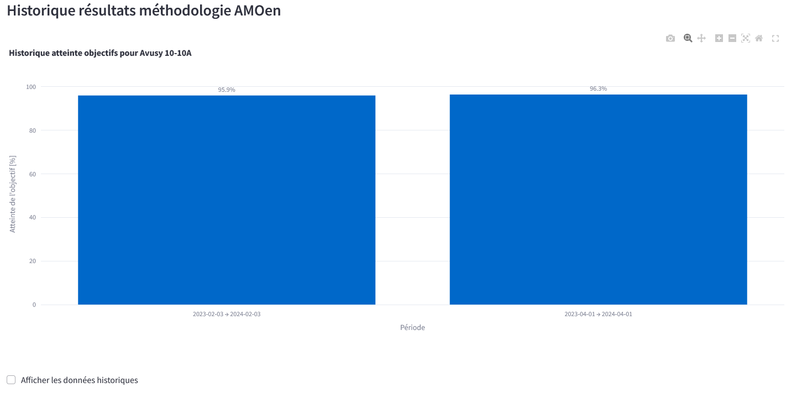

Si l'on coche la case *Afficher les données historiques*, on peut voir les toutes les données utilisées pour le calcul de l'atteinte des objectifs pour chaque période.

### 5 Générer rapport

Cet onglet permet de générer un rapport PDF avec les résultats du calcul de l'atteinte de l'objectif.

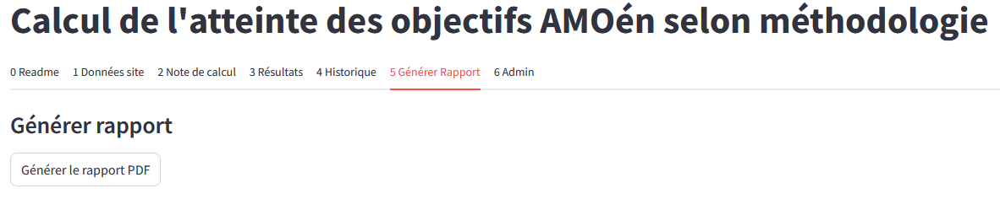

## FAQ

### Site zzz
    
Le site montre ce message:

Veuillez appuyer sur le bouton pour redémarrer le site. Celui-ci se met état de veille pour économiser de l'énergie s'il n'y a pas a eu d'activité depuis quelques jours. Le site se remet en marche au bout de 2-3 minutes.

### Comment changer le mot de passe?

Le menu à gauche de l'écran permet de changer de mot de passe. Il suffit de cliquer sur le bouton *Change password*.

Une fenêtre s'ouvre pour renseigner l'ancien mot de passe et le nouveau mot de passe.

Certaines règles sont à respecter pour le mot de passe:

- Entre 8 et 20 caractères
- Au moins une lettre majuscule
- Un chiffre
- Un caractère spécial [@$!%*?&]

### Changer le mode sombre/clair

Il est possible de changer le mode de l'outil de calcul en mode sombre. Pour cela, il suffit de cliquer sur les trois petits points en haut à droite de l'écran.

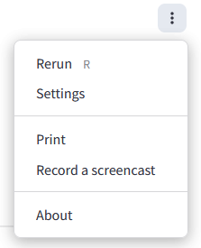

Appuyez sur *Settings* et sélectionnez le mode souhaité.

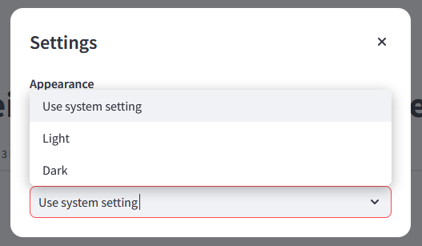

