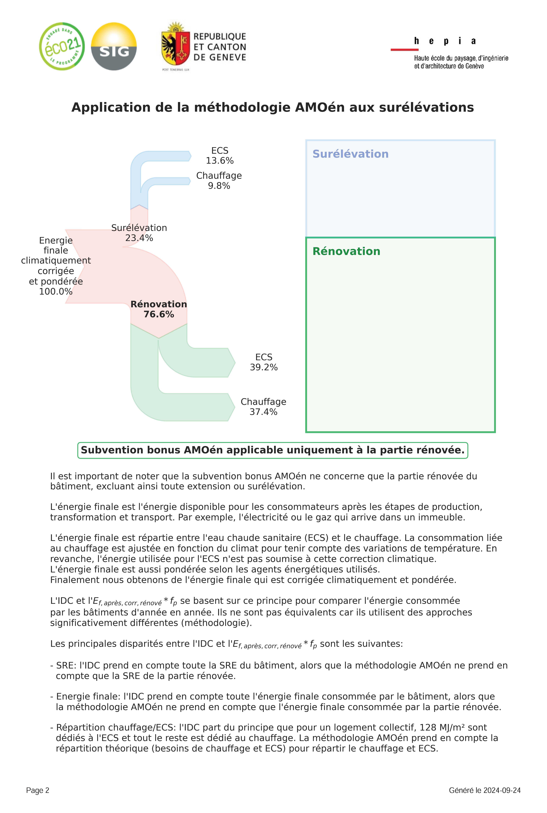

# Documentation  de l'outil de calcul AMOén

Cette documentation a pour but de présenter l'[outil de calcul](https://amoen-calcul.streamlit.app/)
de la méthodologie AMOén et de décrire comment l'utiliser.

## Table des matières

- [TLDR](#tldr)
- [Glossaire](#glossaire)
- [Introduction](#introduction)
- [Onglets](#onglets)
  - [0 Readme](#0-readme)
  - [1 Données du site](#1-données-du-site)
    - [Chargement des données de base du projet](#chargement-des-données-de-base-du-projet)
    - [Elements à renseigner](#elements-à-renseigner)
  - [2 Note de calcul](#2-note-de-calcul)
  - [3 Résultats](#3-résultats)
    - [Synthèse des résultats](#synthèse-des-résultats)
    - [Graphiques](#graphiques)
  - [4 Historique](#4-historique)
    - [Plan](#plan)
    - [Historique IDC](#historique-idc)
    - [Historique résultats méthodologie AMOén](#historique-résultats-méthodologie-amoén)
  - [5 Générer rapport](#5-générer-rapport)
- [Surélévations](#surélévations)
- [FAQ](#faq)
- [Données](#données)

## TLDR

TLDR (Too Long Didn't Read) est une section qui résume les points clés de
l'utilisation de l'outil.

1. Login

    - Se connecter à l'[outil de calcul](https://amoen-calcul.streamlit.app/)
    avec un nom d'utilisateur et un mot de passe.

2. Renseigner projet

    - Aller à l'onglet *"1 Données du site"* :
    - Sélectionner un projet.
    - Renseigner les dates de début et fin de la période de calcul.
    - Renseigner les affectations.
    - Renseigner les agents énergétiques utilisés et les quantités.
    - **Cliquer sur le bouton `Sauvegarder`, sinon les données sont perdues**

3. Vérifier résultats calcul

    - Aller à l'onglet *"3 Résultats"*.
    - Vérifier les résultats du calcul de l'atteinte de l'objectif.

4. Rapport en PDF

    - Aller à l'onglet onglet *"5 Générer rapport"*
    - Cliquer sur le bouton `Générer rapport PDF` pour générer le rapport PDF.

<https://github.com/user-attachments/assets/9b8e56dc-d415-4c36-9d92-0b03a72ec0a4>

## Glossaire

- **AMOén**: Assistant à Maîtrise d'Ouvrage énergie qui participe au programme
AMOén de SIG-éco21/OCEN
- **IDC**: Indice de Dépense de Chaleur
- **OCEN**: Office Cantonal de l'Energie

## Introduction

L'écran d'accueil de l'[outil de calcul](https://amoen-calcul.streamlit.app/)
permet de se connecter à l'outil. Pour cela, il faut renseigner un nom
d'utilisateur et un mot de passe. Vous devriez avoir reçu ces informations par courriel.

Une fois connecté, vous arrivez sur l'écran principal de l'outil.

Celui-ci est composé de plusieurs onglets:

| Onglet | Objectif |
|--------|----------|
| 0 Readme | Rappel des différences entre la méthodologie AMOén et le calcul IDC. Recommendation de 6 mois de donneés minimium pour le calcul de l'atteinte de l'objectif. Lien vers le Github de l'outil. |
| 1 Données du site | Données concernant le site ou l'on souhaite calculer l'atteinte de l'objectif. |
| 2 Note de calcul | Détail de tous les calculs réalisés. |
| 3 Résultats | Résultats du calcul de l'atteinte de l'objectif. |
| 4 Historique | Historique IDC pour le site sélectionné. Historique des calculs de l'atteinte de l'objectif précédents. |
| 5 Générer rapport | Génération du rapport PDF. |
| 6 Admin | Vue réservée aux administrateurs de l'outil. |

---

## Onglets

### 0 Readme

Cet onglet contient:

- un rappel des différences entre la méthodlogie AMOén et le calcul IDC
- la recommendation d'avoir au moins 6 mois de données pour le calcul de
l'atteinte de l'objectif
- le lien vers le Github de l'outil est également disponible

---

### 1 Données du site

Cet onglet contient les informations nécessaires au calcul de l'atteinte de
l'objectif. La première partie est préremplie lors de la sélection du projet et
la deuxième partie est à compléter par l'AMOén.

#### Chargement des données de base du projet

`Sélectionner projet` permet de voir une liste des projets assignés et d'en
sélectionner un. Les données de tous les champs de cette partie sont alors
automatiquement renseignées. Par exemple, dans la vidéo ci-dessous, le projet
"Avusy 10-10A" a été sélectionné.

<https://github.com/user-attachments/assets/8d9f3a86-1e47-4c49-8336-4938cf1569cf>

#### Elements à renseigner

> [!IMPORTANT]  
> **Il est nécessaire de renseigner tous les champs dans cette section pour
pouvoir continuer.**

<https://github.com/user-attachments/assets/899db28c-006b-4cf7-8921-cdfab82a973c>

Comme on peut le voir dans la vidéo ci-dessus, il faut renseigner les données suivantes:

- Dates de début et fin de la période de calcul. Il est recommandé d'avoir au
moins 6 mois de données pour le calcul de l'atteinte de l'objectif. Les dates
peuvent être remplies manuellement ou en utilisant le calendrier.

- Affectations (souvent rempli automatiquement). Les affectations peuvent être
sélectionnés dans la liste déroulante. Il est possible de renseigner plusieurs
affectations. La somme des affectations doit être égale à 100%.

- Agents énergétiques utilisés et quantités.

Pour valider les sélections, il faut soit appuyer sur `Enter ↵` soit cliquer
en dehors de la cellule.

> [!WARNING]  
> **Le bouton `Sauvegarder` permet de valider les données renseignées. Sans cela,
les données renseignées sont perdues.**

##### Note pour les surélévations

> [!NOTE]  
> Voir la section [Surélévations](#surélévations) pour plus d'informations sur
les spécificités des surélévations.

---

### 2 Note de calcul

Cet onglet contient le détail de tous les calculs réalisés. Il est divisé
en plusieurs sections:

- Période sélectionnée: Celle-ci indique le début et la fin de la période de calcul.

- Calculs effectués pour la période sélectionnée: Indique les calculs réalisés
avec des commentaires. Inclus aussi une référence à la cellule Excel correspondante.

- Agents énergétiques: Liste des agents énergétiques utilisés pour le calcul
avec le détail du calcul du facteur de pondération utilisé.

- Données météo station Genève-Cointrin pour la période sélectionnée: données
météo utilisées pour le calcul des degrés-jours.

Cliquer pour voir un example

---

### 3 Résultats

Cet onglet contient les résultats du calcul de l'atteinte de l'objectif.

#### Synthèse des résultats

La première section *Synthèse des résultats* indique le pourcentage d'atteinte
de l'objectif. Si ce pourcentage est supérieur ou égal à 85%, l'objectif est atteint.
Si ce pourcentage est inférieur à 85%, l'objectif n'est pas atteint.

#### Graphiques

La deuxième section *Graphiques* contient le graphique qui résume les résultats
du calcul.

Il est possible de sauvegarder ce graphique en faisant clic sur le bouton droit
de la souris et en sélectionnant *Enregistrer l'image sous...*.

Cliquer pour voir un example

---

### 4 Historique

Cet onglet contient l'historique des résultats obtenus et l'IDC pour le site sélectionné.

#### Plan

Si l'on sélectionne la case `Afficher la carte`, on peut voir le plan de
situation du site.

Cliquer pour voir un example

Cette option est désactivée par défaut pour des raisons de performance.

#### Historique IDC

Cette section contient un historique des IDC pour le site sélectionné.

Cliquer pour voir un example

Si l'on coche la case `Afficher les données IDC`, on peut voir les données
utilisées pour ce graphique.

#### Historique résultats méthodologie AMOén

Cette section contient un historique de l'atteinte de l'objectif pour le site sélectionné.
Les résultats sont classés par date de calcul.

Cliquer pour voir un example

Si l'on coche la case `Afficher les données historiques`, on peut voir toutes les
données utilisées pour le calcul de l'atteinte des objectifs pour chaque période.

---

### 5 Générer rapport

Cet onglet permet de générer un rapport PDF avec les résultats du calcul de
l'atteinte de l'objectif. La vidéo ci-dessous détaille le processus.

https://github.com/user-attachments/assets/225a7075-a524-4613-9449-c69f31b88f1f

## Surélévations

Cette section décrit les spécificités des surélévations.

Le tableau ci-dessous regroupe les remarques concernant l'onglet *1 Données du site*.

| Section | Menu concerné | Commentaire | Renseigné automatiquement |
| ------- | ------------- | ----------- | ------------------------- |
| Chargement données de base du projet | SRE rénovée (m²) | Seulment la SRE de la partie rénovée. La SRE de la surélévation est exclue. | oui |
| Chargement données de base du projet | Ef,obj * fp [kWh/m²/an] | Concerne seulement la partie rénovée | oui |
| Chargement données de base du projet | Chauffage partie surélévée/ECS partie surélévée [%] | Répartition énergie finale pour la surélévation | oui |
| Eléments à renseigner | Affectations | Affectations de tout le bâtiment | Souvent |
| Eléments à renseigner | Agents énergétiques | Agents énergétiques de tout le bâtiment | non |

Le rapport inclus une deuxième page avec des informations spécifiques aux surélévations.

Cliquer pour voir un example

## FAQ

### Site zzz

Le site montre ce message:

Veuillez appuyer sur le bouton pour redémarrer le site. Celui-ci se met état de
veille pour économiser de l'énergie s'il n'y a pas a eu d'activité depuis
quelques jours. Le site se remet en marche au bout de 2-3 minutes.

### Comment changer le mot de passe?

Le menu à gauche de l'écran permet de changer de mot de passe. Il suffit de
cliquer sur le bouton *Change password*.

Une fenêtre s'ouvre pour renseigner l'ancien mot de passe et le nouveau mot de passe.

Les nouveaux mots de passe doivent respecter les critères suivants:

- Entre 8 et 20 caractères
- Au moins une lettre majuscule
- Un chiffre
- Un caractère spécial [@$!%*?&]

### Changer le mode sombre/clair

Il est possible de changer le mode de l'outil de calcul en mode sombre. Pour cela,
il suffit de cliquer sur les trois petits points en haut à droite de l'écran.

Appuyez sur *Settings* et sélectionnez le mode souhaité.

### Comment ajouter un nouveau projet?

Pour l'instant il n'y a pas de manière automatisée pour ajouter un nouveau projet.
Il faut contacter l'administrateur de l'outil pour ajouter un nouveau projet.

## Données

Cette section décrit la provenance des données utilisées dans l'outil de calcul.

### Données météo

Les données météo utilisées sont fournies par MétéoSuisse. Elles sont
téléchargées automatiquement depuis les liens suivants:

- Historiques des données pour Genève-Cointrin: <https://data.geo.admin.ch/ch.meteoschweiz.klima/nbcn-tageswerte/nbcn-daily_GVE_previous.csv>
- Données pour l'année actuelle Genève-Cointrin: <https://data.geo.admin.ch/ch.meteoschweiz.klima/nbcn-tageswerte/nbcn-daily_GVE_current.csv>

L'outil utilise les données `tre200d0` qui correspondent à la température
moyenne journalière à 2 mètres au dessus du sol.

### Données IDC

Les données IDC sont fournies par l'OCEN via SITG. Elles sont téléchargées
automatiquement depuis <https://ge.ch/sitg/fiche/2177>

### Données des projets

Les données des projets AMOén viennent du tableau Excel qui fixe
l'atteinte des objectifs pour chaque site.
